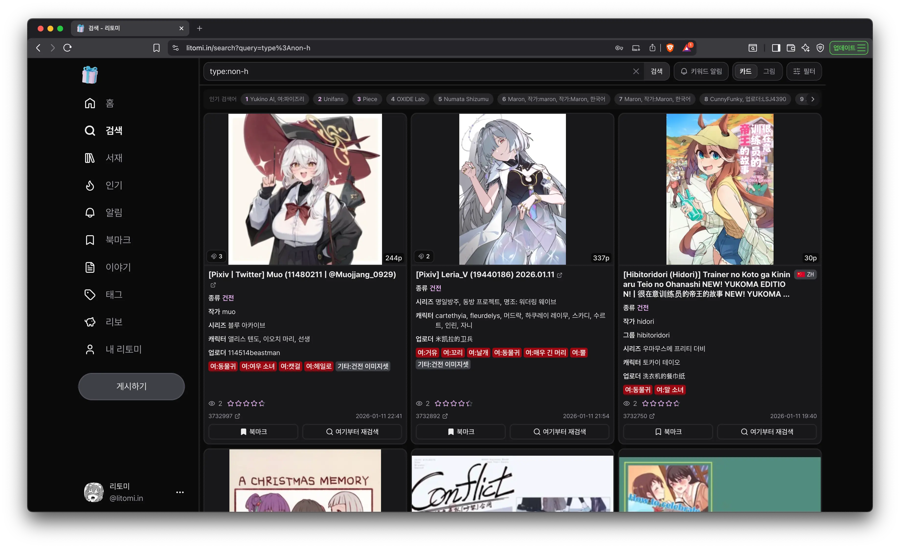
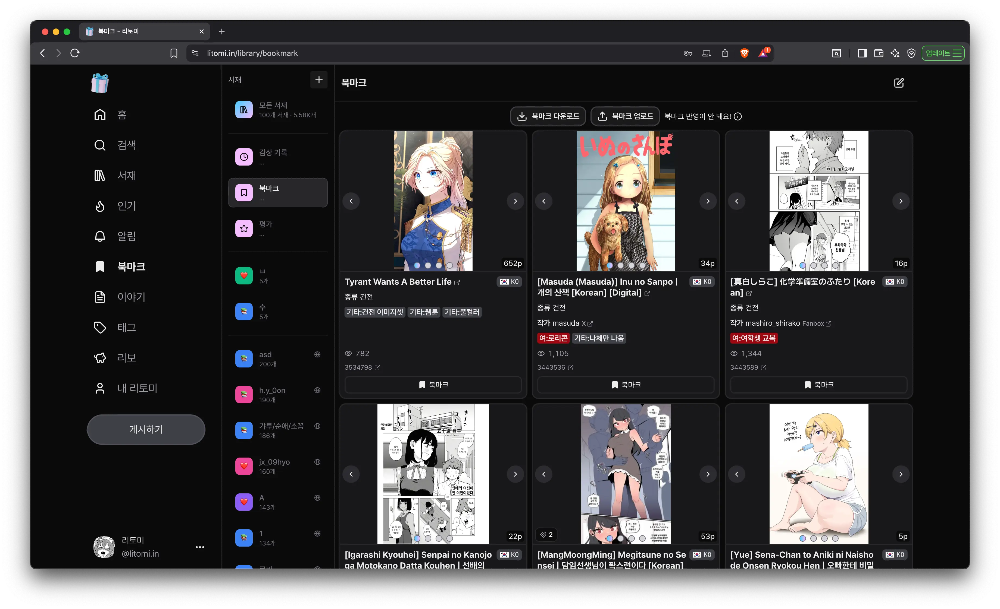

# litomi

만화 웹 뷰어예요. 안전하고 쾌적한 감상 경험을 목표로 해요.  
코드는 항상 공개해서 오픈 소스로 운영하려고 해요.

English README: [`README.en.md`](README.en.md)

## 미리보기




## 기능

- **감상(뷰어)**
  - 터치보기, 스크롤보기
  - 한 쪽 보기, 두 쪽 보기
  - 상하 넘기기, 좌우 넘기기
  - 상하 스와이프로 밝기 조절
  - 좌우 스와이프로 페이지 넘기기
  - 이미지 레이아웃 조정
  - 자동 넘기기
  - 마지막 감상 페이지부터 이어서 보기
  - 미리보기(썸네일)
  - 터치보기: 스크롤로 페이지 넘기기
  - 터치보기: meta + 스크롤로 이미지 확대
  - 스크롤보기: 이미지 너비 조절
- **검색/탐색**
  - 카드 보기, 이미지(그림) 보기
  - 고급 필터(조회수/페이지/별점/기간 등 범위 조건)
  - 정렬(인기순/오래된 순/랜덤)
  - 인기 검색어
  - 최근 검색어
  - 신작
  - 랜덤(20초마다 자동 갱신)
  - 이 작품과 함께 좋아한 작품 추천(별점 기반)
  - 태그 탐색(카테고리별) + 태그 한글 번역
- **서재/기록**
  - 북마크
  - 북마크 백업: 다운로드/업로드(JSON)
  - 감상 기록
  - 작품 평가(별점) + 평가 목록
  - 서재: 북마크 폴더별 정리
  - 서재 일괄 작업: 복사/이동/제거
  - 데이터 내보내기(비밀번호 확인): 북마크/기록/별점/서재/검열 설정
- **검열**
  - 키워드로 작품 검열
  - 규칙 가져오기/내보내기(JSON/CSV)
- **알림**
  - 알림 센터: 읽음 처리/삭제/필터링(미확인/신규 작품 등)
  - 키워드 알림
  - 웹 푸시 알림
- **인기/랭킹**
  - 조회수/북마크 등의 기간별 인기 순위
  - 실시간 인기 페이지 순위 (Google Analytics Data API)
- **이야기(포스트)**
  - 추천 타임라인
  - 글/이미지 포스트
  - 좋아요/리포스트/댓글/조회수
- **계정/보안**
  - 회원가입, 로그인
  - 성인인증(BBaton)
  - 패스키 로그인(WebAuthn)
  - 2단계 인증(TOTP)
- **안전**
  - 작품 신고
- **리보(포인트)**
  - 적립/상점/내역
- **앱 설치**
  - PWA 설치(홈 화면에 추가)
  - Android APK 설치 안내

## 기술 스택

- Next.js (App Router)
- React
- TypeScript
- Tailwind CSS
- Drizzle ORM
- TanStack Query
- Hono (Backend)

## 로컬 개발 (Quickstart)

로컬 개발은 **Postgres + Redis(docker compose) + Backend + Web**을 모두 띄우는 구성이에요.

### 준비물

- Bun (권장: `package.json`의 `devDependencies.bun` 버전 근처)
- Docker + Docker Compose

### 1) 의존성 설치

```bash
bun install
```

### 2) Postgres/Redis 실행 (docker compose)

```bash
bun db
```

기본 포트:

- Web: `3000`
- Proxy: `3001`
- Backend: `3002`
- Postgres: `5434`
- Serverless Redis HTTP: `8079`

> 참고: `bun db`은 `docker compose down -v`를 포함해서 **DB 볼륨이 초기화돼고 DB 스키마 반영까지 진행돼요**. 처음부터 다시 시작할 때만 사용해 주세요.

### 3) 서비스 실행

```
bun dev
```

## 기타 스크립트

### 1) DB 스키마 반영 (Drizzle)

```bash
# Supabase 스키마
bun run db:push

# Aiven 스키마
bun run db:push:aiven
```

### 2) Backend 실행

```bash
bun run dev:backend
```

### 3) 모두 실행

```bash
bun dev
```

## 테스트

- 문서: [`docs/testing.md`](docs/testing.md)
- 대표 커맨드:
  - `bun test`
  - `bun run test:e2e`

## 모바일

- 문서: [`docs/mobile-distribution.md`](docs/mobile-distribution.md)

## 배포

- **Vercel (Web)**: Next.js 앱 배포에 사용해요.
- **Cloud Run (Job)**: 주기 작업(데이터 동기화/알림)을 배포할 때 사용해요.
  - [`cloud-run/manga-crawl/README.md`](cloud-run/manga-crawl/README.md)
  - [`cloud-run/crawl-and-notify/README.md`](cloud-run/crawl-and-notify/README.md)

### 프로덕션 DB 연결 원칙

- 오래 떠 있는 k8s `web`/`backend` Pod는 Supabase `direct connection`을 우선 사용해요.
- 클러스터에서 IPv6 egress가 어려우면 Supabase `session mode`를 런타임 대안으로 사용해요.
- `transaction mode`는 Cloud Run 같은 단명 작업에만 사용하고, 장수명 Pod에는 사용하지 않아요.
- 앱 풀은 서비스별로 명시적으로 제한해요. 기본값은 `POSTGRES_POOL_MAX=3`, `POSTGRES_IDLE_TIMEOUT_SECONDS=20`, `POSTGRES_CONNECT_TIMEOUT_SECONDS=10`, `POSTGRES_MAX_LIFETIME_SECONDS=1800`이에요.
- `POSTGRES_APPLICATION_NAME`을 설정해서 `pg_stat_activity`에서 `litomi-web`, `litomi-backend`를 바로 구분해요.
- readiness 체크는 메인 풀과 분리된 1-connection health client와 짧은 캐시를 사용해 DB와 과하게 경쟁하지 않게 해요.

## 기여하기

기여는 언제든 환영해요.

- [`CONTRIBUTING.md`](CONTRIBUTING.md)
- [`SECURITY.md`](SECURITY.md)
- [`CODE_OF_CONDUCT.md`](CODE_OF_CONDUCT.md)

## License

GPL-3.0. 자세한 내용은 [`LICENSE`](LICENSE)를 확인해 주세요.
